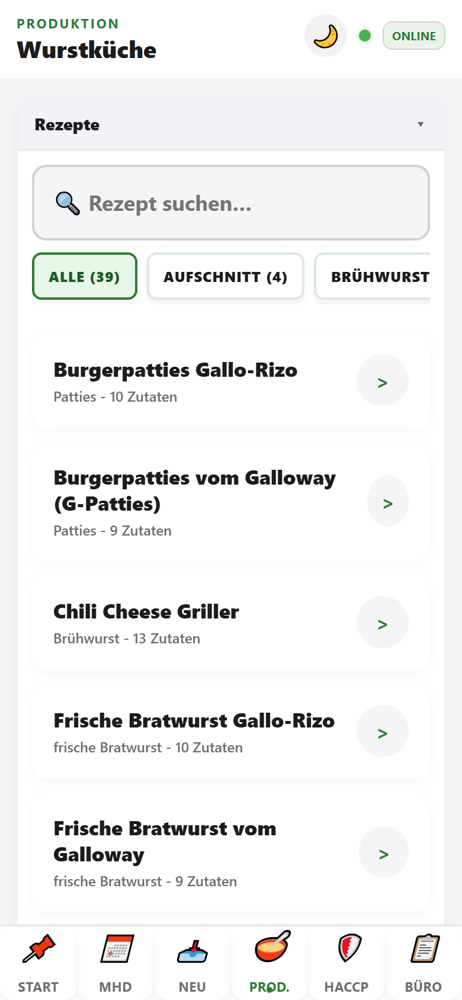
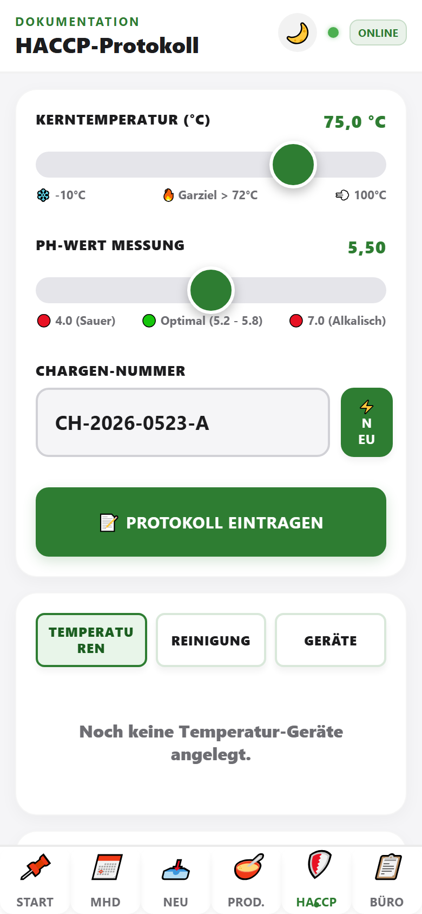
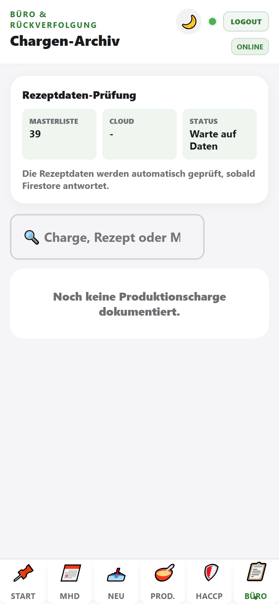
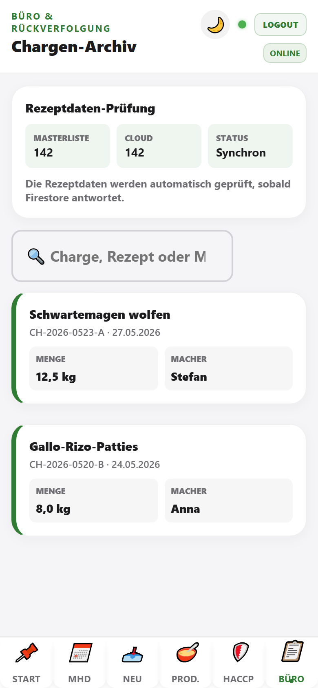

# Hofladen-App: Walkthrough fuer das Team

Diese Anleitung fuehrt Schritt fuer Schritt durch den Tagesablauf in der aktuellen App-Version.

**Ausfuehrliche Modulanleitungen (alle Details):** [modulanleitungen/README.md](./modulanleitungen/README.md)

## 1. Start (Schwarzes Brett + Aufgaben)

Der Tab **Start** ist jetzt der Einstieg fuer das Team.

1. App oeffnen und im **Start**-Tab bleiben.
2. Mitarbeitername eintippen (Vorschlaege erscheinen automatisch) und PIN eingeben.
3. Auf **Anmelden** tippen.
4. **Nachricht des Tages** lesen (inkl. Bilder/PDF-Anhaenge).
5. Offene Aufgaben in **Meine Aufgaben** nacheinander mit **Erledigt** abschliessen.
6. Erledigte Aufgaben in der **Historie** pruefen, bei Bedarf Zeitraum filtern.

Hinweise:
- Unter **Angemeldet als** seht ihr, wer aktiv ist.
- Aufgaben koennen personengebunden oder schichtbezogen sein.
- Historie-Filter: **Heute**, **7 Tage**, **30 Tage**, **Alle**.

## 2. MHD (taeglicher Morgencheck)

Im Tab **MHD** prueft ihr, welche Ware sofort bearbeitet werden muss.

1. Tab **MHD** oeffnen.
2. Auf **Filter anpassen** tippen.
3. Im Bottom-Sheet **Bereich**, **Kategorie** und **Ansicht** waehlen.
4. Mit **Fertig** schliessen.
5. Karten nacheinander bearbeiten:
   - **✓ OK**
   - **↩️ Raus**
   - **🥣 Kueche**
   - **🗑️ Ausverkauft**
6. Optional Menge ueber **+ / -** korrigieren.

## 3. Neu (Wareneingang)

Der Tab **Neu** ist fuer neue Lieferungen und Erfassungen.

### Laden

1. Tab **Neu** oeffnen, Modus **Laden** aktivieren.
2. Barcode scannen oder EAN eintippen.
3. Artikel pruefen bzw. Namen ergaenzen.
4. Menge und MHD eintragen.
5. **Posten hinzufuegen**.

### Metzgerei

1. Auf **Metzgerei** wechseln.
2. Lieferant, Kategorie und Temperatur eintragen.
3. Lieferscheinfotos aufnehmen.
4. Als Entwurf speichern oder gesamte Lieferung abschliessen.

## 4. Prod. (Wurstkueche)

Der Tab **Prod.** ist in zwei aufklappbare Bereiche unterteilt:
- **Rezepte** (standardmaessig offen)
- **WRS Kalkulation** (standardmaessig zugeklappt)

Ablauf:
1. Rezept auswaehlen.
2. Zielmenge einstellen.
3. Zutaten/Schritte pruefen.
4. Produktion und Verkaufseinheiten dokumentieren.

## 5. HACCP

Im Tab **HACCP** werden Kontrollen dokumentiert.

1. Tab **HACCP** oeffnen.
2. Temperaturbereich bearbeiten.
3. Kerntemperatur eintragen, danach pH-Wert erfassen.
4. Speichern.
5. Bei Bedarf Reinigungsdokumentation erledigen.

## 6. Buero (Chargen)

Der Tab **Buero** dient der Rueckverfolgung.

1. Tab **Buero** oeffnen.
2. Nach Charge, Rezept oder Mitarbeiter suchen.
3. Chargendetails kontrollieren.

## Morgenroutine (Kurz)

1. **Start**: anmelden, Nachricht lesen, Aufgaben pruefen.
2. **MHD**: Filter setzen, kritische Karten bearbeiten.
3. **HACCP**: Temperaturen, Kernwerte und Reinigung dokumentieren.

## Liefertag (Kurz)

1. **Neu > Laden**: Ware erfassen.
2. **Neu > Metzgerei**: Lieferdaten/Fotos dokumentieren.
3. Lieferung abschliessen und in Verlauf pruefen.
