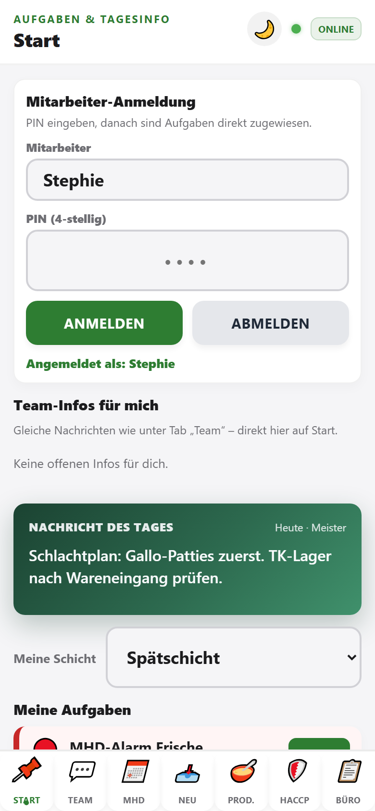

# TorFabrik Krefeld: Walkthrough für das Team (CenterLogic)

Diese Anleitung gilt für den Mandanten **TorFabrik Krefeld** (`tenantId: torfabrik`). Die App erscheint als **CenterLogic** (grüner Akzent, gelber Header).

**Modul-Details mit Screenshots:** [modulanleitungen/README.md](./modulanleitungen/README.md) (UI entspricht weitgehend StevesHof, Tabs können abweichen).

**StevesHof-Anleitung:** [KOLLEGEN_ANLEITUNG_HOFLADEN_APP.md](./KOLLEGEN_ANLEITUNG_HOFLADEN_APP.md)

---

## Besonderheiten TorFabrik

| Thema | Verhalten |
|-------|-----------|
| **Solo-Betrieb** | Standard-Ansicht **„Alle meine Bereiche“** – alle offenen Aufgaben aus Theke, Küche & Events, Halle auf einen Blick |
| **Betriebsbereiche** | Theke · Küche & Events · Halle · Allgemein |
| **Team** | Stephan, Boris, Aushilfe (keine StevesHof-Namen) |
| **Tab Prod.** | **Nicht aktiv** (keine Wurstküche im Center) |
| **Wareneingang** | Kategorien: Getränke (Jakob Bayen), TK & Snacks (Metro), Zubehör & Hygiene (Metro) |
| **KI-Lieferschein** | Tab **Neu** → **📸 Lieferschein scannen (KI)** (Metro / Jakob Bayen) |
| **Rolle „helper“** | Nur **Start** + **MHD** (vereinfachte Ansicht für Aushilfen) |

---

## Mitarbeiter & PINs (PIN-Login unter Start)

| Mitarbeiter | PIN | Typische Rolle |
|-------------|-----|----------------|
| **Stephan** | `1111` | Leitung / Admin |
| **Boris** | `2222` | Leitung / Admin |
| **Aushilfe** | `3333` | Aushilfe (ggf. vereinfachte App) |

Die Namen in der Anmeldung kommen aus der **Team-Konfiguration** (`tenants/torfabrik/settings/teamDashboard`). Stephan kann sie unter **Büro → Leitstand → Team-Konfiguration** anpassen.

**Betriebs-Login (E-Mail):** z. B. `info@torfabrik-krefeld.de` im Firebase-Projekt **charculogic-whitelabel-test**. Mandant und Rolle stehen im Firestore-Dokument `users/{uid}` (Felder `tenantID` oder `tenantId`, `role`).

---

## Tabs in der unteren Leiste (TorFabrik)

| Tab | Zweck |
|-----|--------|
| **Start** | PIN-Anmeldung, Nachricht des Tages, Aufgaben, Historie |
| **Team** | Nachrichten, Kundenbestellungen |
| **MHD** | MHD-Alarme, Qualitätssicherung |
| **Neu** | Wareneingang + **KI-Lieferschein** |
| **HACCP** | Temperatur- & Reinigungsprotokolle |
| **Büro** | Chargen (falls genutzt), Leitstand (Admin) |

> Der Tab **Prod.** (Wurstküche) ist für TorFabrik **ausgeblendet**.

---

## 1. Start (Teamboard)

1. App öffnen: **https://charculogic-whitelabel-test.web.app** (oder vom Homescreen).
2. Mit **E-Mail/Passwort** anmelden (Betriebs-Login).
3. Tab **Start** → **Mitarbeiter** wählen (Stephan / Boris / Aushilfe) und **4-stellige PIN** eingeben.
4. **Mein Bereich:** für Solo-Betrieb **„Alle meine Bereiche“** lassen – sonst z. B. **Theke** oder **Küche & Events** filtern.
5. **Nachricht des Tages** lesen, **Meine Aufgaben** mit **✓** quittieren.

---

## 2. Team

Zuerst unter **Start** per PIN anmelden, dann Tab **Team** für Infos/Aufgaben und **🛒 Bestellungen** für Kundenaufträge.

Details: [modulanleitungen/06-team.md](./modulanleitungen/06-team.md)

---

## 3. MHD (Morgencheck)

1. Tab **MHD** → Filter **ALARM** (oder **AKTION**).
2. Karten bearbeiten: **✓ OK**, **↩️ Raus**, **🥣 Küche**, **🗑️ Ausverkauft**.
3. **💾 Änderungen speichern**.

Kategorien im Wareneingang sind an Metro/Jakob Bayen angepasst; die MHD-Liste selbst kommt aus `tenants/torfabrik/mhd_liste`.

Details: [modulanleitungen/01-mhd-monitor.md](./modulanleitungen/01-mhd-monitor.md)

---

## 4. Neu (Wareneingang & KI-Lieferschein)

### KI-Lieferschein (empfohlen für Metro / Jakob Bayen)

1. Tab **Neu** → **📸 Lieferschein scannen (KI)**.
2. Foto vom Lieferschein aufnehmen oder Bild wählen.
3. Erkannte Positionen in der Tabelle prüfen/korrigieren.
4. **In Bestand speichern** → Einträge landen in `tenants/torfabrik/inventory`.

### Einzelscan (Barcode)

1. **Kategorie** wählen (z. B. **Getränke (Jakob Bayen)**).
2. Bei **Fass/Anstich** schlägt die App oft **MHD +14 Tage** vor.
3. **Barcode scannen**, Menge und MHD erfassen, **➕ Posten hinfägen**.

Metzgerei-Modus bleibt verfügbar, ist für das Center aber selten nötig.

Details: [modulanleitungen/02-wareneingang.md](./modulanleitungen/02-wareneingang.md)

---

## 5. HACCP

Temperatur- und Reinigungskontrollen wie in der Standard-Anleitung.

Details: [modulanleitungen/04-haccp.md](./modulanleitungen/04-haccp.md)

---

## 6. Büro (Admin: Stephan / Boris)

1. Tab **Büro** → Chargen prüfen (falls Produktion dokumentiert wird).
2. **Leitstand:** Nachricht des Tages, **Team-Konfiguration** (Mitarbeiterliste, Gruppen).

---

## Rolle „Aushilfe“ (Firebase `role: helper`)

Wenn ein Nutzer die Rolle **helper** hat (nicht nur den Namen „Aushilfe“ im PIN-Login):

- Sichtbar: **Start** (Aufgaben) und **MHD** (Alarme).
- Ausgeblendet: Team, Neu, HACCP, Büro, Stammdaten.

Für reguläre Aushilfen reicht meist der **PIN-Login als Mitarbeiter „Aushilfe“** mit voller Tab-Leiste.

---

## Tagesablauf Solo (Kurz)

| Zeit | Schritte |
|------|----------|
| **Morgens** | Start (PIN) → MHD ALARM → HACCP Temperaturen |
| **Lieferung** | Neu → KI-Lieferschein oder Scan → Kategorien Metro/Bayen |
| **Tagsüber** | Aufgaben auf Start quittieren, Team-Infos lesen |
| **Abends** | MHD offene Punkte, ggf. Wareneingang abschließen |

---

## Admin: Team-Liste in Firestore ändern

**In der App (empfohlen):** Büro → Leitstand → **Team-Konfiguration** → Mitarbeiter (kommagetrennt) → Speichern.

**In der Console:** `tenants/torfabrik/settings/teamDashboard` mit Feldern `employees`, `groups`, `tenantId`.

Beim ersten Start ohne gültige Konfiguration seedet die App automatisch Stephan, Boris und Aushilfe (nur als Admin nach Login).
