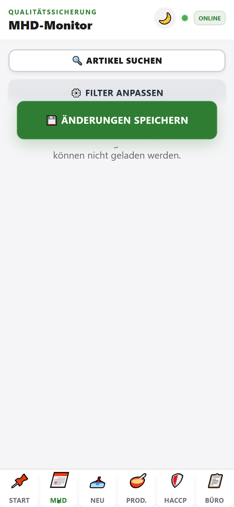
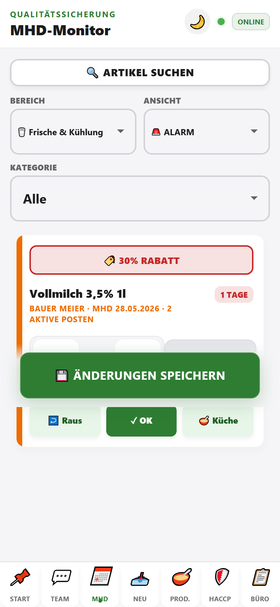
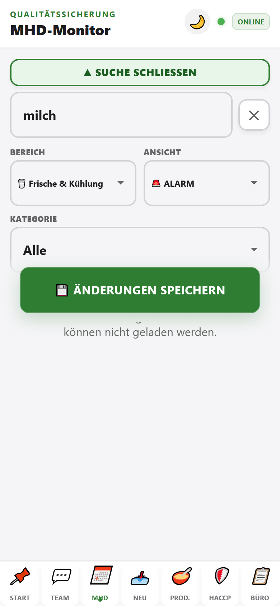

# MHD-Monitor

Der Tab **MHD** ist der zentrale Bereich für den täglichen Morgencheck: Welche Ware läuft in den nächsten Tagen ab, muss reduziert oder aus dem Verkauf?

## Wofür?

- Qualitätssicherung im Hofladen
- Automatische Liste aller Posten mit **MHD im gewählten Zeitraum**; Standard sind **21 Tage**
- Optional nach **Zeitraum** und **Kategorie** filtern
- Einzelne **Posten** bearbeiten (gleiche Artikel können mehrfach vorkommen)

## Oberfläche

### 1. Filter (Toolbar)

| Element | Funktion |
|---------|----------|
| **Zeitraum** | Auswahl zwischen **7**, **14** und **21 Tagen**; Standard sind **21 Tage** |
| **Kategorie** | Alle Kategorien oder gezielt: Frische, MoPro, Kühlware, TK, Getränke, Trockenware, Gewürze |

Es gibt keine separaten Filter mehr für **Bereich** oder **Ansicht (ALARM/AKTION)**. Kritische Ware erscheint automatisch, sobald das MHD im gewählten Zeitraum liegt.

### 2. MHD-Karte (Posten)

Jede Karte ist **ein Posten** (eigenes MHD / eigene Lieferung).

- **Badge oben**: empfohlene Aktion (z. B. Rabatt, Prüfen, Tonne)
- **Menge**: **−** / **+** oder direkt in das Zahlenfeld tippen
- **🗑️ Ausverkauft** oder Wischen nach **links**
- **Aktionen**: **↩️ Raus** · **✓ OK** · **🥣 Küche**
- **Reduziert**: Karte nach **rechts wischen**

### 3. Artikel suchen (optional)

1. **🔍 Artikel suchen** antippen
2. Suchbegriff eingeben (z. B. „milch“)
3. Mit **▲ Suche schließen** einklappen – der Kategorie-Filter bleibt aktiv

### 4. Speichern

**💾 Änderungen speichern** – bei aktivem Firebase-Sync werden Änderungen in die Cloud geschrieben.

## Ablauf Morgencheck

1. Tab **MHD** öffnen (beim Laden-iPhone automatisch)
2. Bei Bedarf **Zeitraum** und **Kategorie** wählen
3. Karten der Reihe nach abarbeiten
4. **Änderungen speichern**

## Hinweise

- **„X aktive Posten“** unter dem Namen = mehrere offene Einträge mit gleichem Barcode
- **Hersteller / Zusatz** erscheint in der Meta-Zeile, wenn beim Wareneingang erfasst
- Ohne Firebase-Verbindung erscheint ein Hinweis, dass keine MHD-Daten geladen werden können
