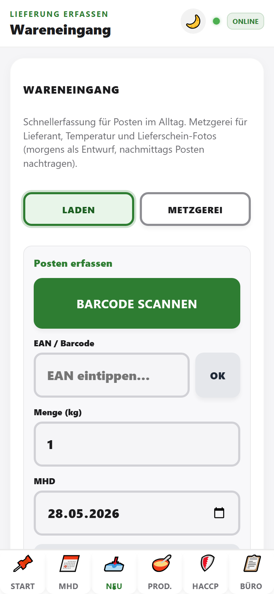
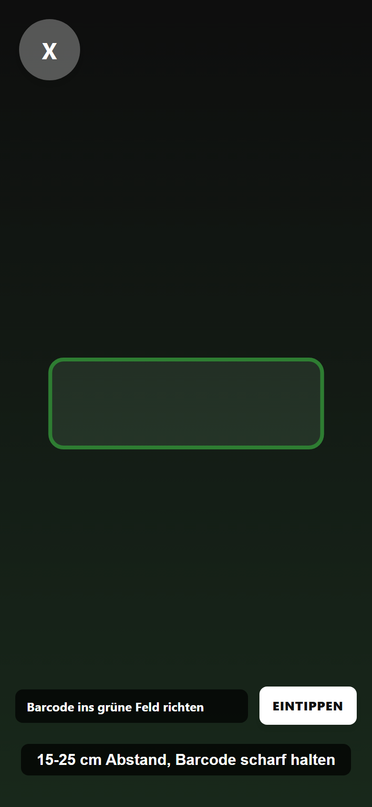
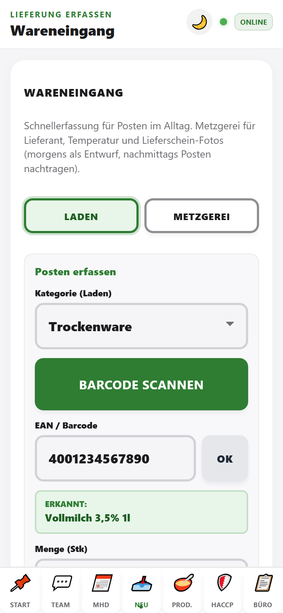

# Wareneingang (Tab „Neu“)

Hier erfassen wir **Lieferungen**: Lieferschein-Fotos, Lieferant, Temperatur und die einzelnen **Posten** (Artikel mit MHD).

> **TorFabrik (`torfabrik`):** Zusätzlich **„Lieferschein scannen (KI)“** (Gemini) – geparste Posten landen in `tenants/torfabrik/inventory`. Details: [KOLLEGEN_ANLEITUNG_TORFABRIK.md](../KOLLEGEN_ANLEITUNG_TORFABRIK.md).

## Zwei Bereiche

Oben wählen wir zwischen:

| Modus | Inhalt |
|-------|--------|
| **Laden** | Kategorie, Barcode/EAN, Menge, MHD, Postenliste |
| **Metzgerei** | Lieferant, Waren-Kategorie, Temperatur, Lieferschein-Fotos |

Speichern-Buttons und **offene Lieferungen** gelten für die ganze Lieferung.

> **StevesHof Hofladen (`StevesHof_Hauptbetrieb`):** Derzeit ist bewusst nur der Bereich **Laden** aktiv. Die Metzgerei-Erfassung bleibt für diesen Mandanten ausgeblendet.

---

## Laden (Schnellerfassung)

### Schritte

1. Tab **Neu** → **Laden**
2. **Kategorie (Laden)** wählen — Frische, MoPro, Kühlware, TK, Getränke, Trockenware oder Gewürze
3. **Barcode scannen** (grüner Button) oder **EAN** eintippen und **OK**
4. **Bekannte EAN**: grüne Zeile **Erkannt: …**
5. **Unbekannte EAN**: **Produktname** eintragen
6. Optional **Hersteller / Zusatz** ergänzen (erscheint später in der MHD-Ansicht)
7. **Menge** setzen und **MHD** direkt als `TT.MM.JJJJ` eintippen, z. B. `31.12.2026`
8. **➕ Posten hinzufügen** – für jeden weiteren Artikel wiederholen
9. Optional **Letzte Eingänge** — Kategorien nachträglich korrigieren (siehe unten; für alle Nutzer mit Tab **Neu**)
10. Optional **Stammdaten** — nur Büro-/Admin-Zugang (gelernte EANs auf diesem Gerät)

### Kategorie bei Serien-Scans

Die ausgewählte Laden-Kategorie bleibt nach **Posten hinzufügen** für den nächsten Scan erhalten. Wer gerade nur MoPro, Frische oder TK-Ware verräumt, muss die Kategorie daher nicht bei jedem Artikel neu auswählen.

Die Kategorie kann jederzeit geändert werden — sie gilt für den nächsten Posten.

Das MHD-Feld ist nach jedem hinzugefügten Posten wieder leer. So können wir das nächste Datum direkt eintippen, ohne vorher ein altes Datum zu löschen.

### Letzte Eingänge korrigieren

Über **Letzte Eingänge** werden die zuletzt erfassten Wareneingänge angezeigt. Pro Artikel kann die Kategorie geprüft, per Dropdown geändert und mit **Kategorie speichern** berichtigt werden. Die Änderung wird auch bei schwacher Verbindung synchronisiert.

| Funktion | Zugriff |
|----------|---------|
| **Letzte Eingänge** (Button im Tab **Neu**) | Alle angemeldeten Nutzer mit sichtbarem Tab **Neu** — kein separater Büro-Login |
| **Stammdaten** | Nur Büro-/Admin-Konten |
| **Letzte Eingänge** (Tab **Büro**) | Zusätzlich im Büro-Bereich für Auswertung am Schreibtisch (gleiche Ansicht) |

Test- und Fehleinträge können dort auch **gelöscht** oder über **Posten ansehen** geöffnet werden.

### Scanner

- Barcode ins **grüne Feld** halten (ca. 15–25 cm Abstand)
- Unten: **Eintippen** → Barcode manuell → **OK**
- Scan im Tab **Neu** füllt nur den aktuellen Posten

### Posten erkannt

- Grüne Zeile **Erkannt:** nach bekannter EAN
- Liste darunter: bereits hinzugefügte Posten (mit **×** entfernen)

---

## Metzgerei

### Schritte

1. Auf **Metzgerei** wechseln
2. **Lieferant** (oder **🏠 Eigenproduktion**)
3. **Waren-Kategorie** und **Temperatur (°C)**
4. **📸 Lieferscheine fotografieren** (mindestens ein Foto für Entwurf)
5. **📝 Als offenen Entwurf speichern** – auch ohne Posten (morgens nur dokumentieren)

Mit **×** auf der Miniatur ein Foto wieder entfernen.

Bei Temperatur über 7 °C kann eine **Meister-Freigabe** (PIN) nötig sein.

---

## Lieferung abschließen

1. Unter **Laden** mindestens einen Posten erfassen
2. Unter **Metzgerei** Lieferant (und ggf. Fotos) pflegen
3. **💾 Gesamte Lieferung abschließen**

## Offene Lieferungen (unten)

- Liste **📋 Offene Lieferungen zur Nachbearbeitung**
- Entwurf antippen → App springt zur Erfassung
- Posten anhand der Fotos nachtragen → **Lieferung abschließen**

## Wichtig

Jeder Wareneingang ist ein **eigener Posten** im Tab **MHD** – neue Lieferung ersetzt nicht automatisch alte Ware mit kurzem MHD.
