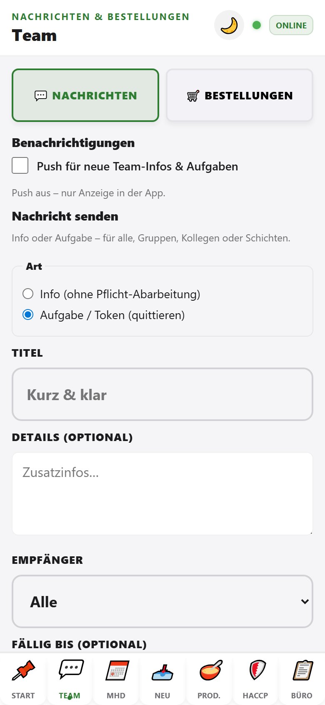

# Team (Nachrichten, Bestellungen & Temperatur-Check)

Der Tab **Team** bündelt Kommunikation, Kundenbestellungen und den schnellen **Temperatur-Check**. Welche Reiter erscheinen, richtet sich nach den freigeschalteten Bereichen des Mandanten. Die Anmeldung erfolgt – wo Nachrichten und Bestellungen aktiv sind – immer zuerst unter **Start** (Name + PIN).

**Mitarbeiter & PINs** sind mandantenabhängig (z. B. TorFabrik: Stephan, Boris, Aushilfe). Sie werden aus `tenants/{tenantId}/settings/teamDashboard` geladen – siehe [Kollegen-Anleitungen](../README.md).

> **StevesHof Hofladen:** Der Tab **Team** ist ausgeblendet — Temperaturen dokumentieren wir im Tab **HACCP**. Am Laden-iPhone melden wir uns mit dem Geräte-Zugang an und wählen danach unser **Profil** (ohne PIN) für MHD und Wareneingang.

## Nachrichten

### Benachrichtigungen

- **Push** optional aktivieren – sonst nur Anzeige in der App.
- Statuszeile zeigt, ob Push registriert ist.

### Nachricht senden

- **Info** oder **Aufgabe** an alle, Gruppen, einzelne Kollegen oder Schichten.
- Empfänger und Priorität (Rot / Gelb / Grün) wählen.
- Gesendete Infos erscheinen bei den Empfängern unter **Team-Infos für mich** (auch auf **Start**).

### Team-Infos für mich

- Eingehende Nachrichten und Aufgaben.
- Mit **✓** quittieren, wenn erledigt oder gelesen.

## Bestellungen

Wechsel über **🛒 Bestellungen** in der Team-Leiste.

### Kundenbestellung aufnehmen

| Feld | Bedeutung |
|------|-----------|
| **Name des Kunden** | Pflicht |
| **Rückrufnummer** oder **E-Mail** | mindestens eines empfohlen |
| **Bereit am** / **Uhrzeit** | Abholtermin |
| **Bestellpositionen** | Artikelzeilen mit **+ Position** |
| **Weitere Wünsche** | z. B. mariniert, vakuumiert, TK |
| **Bestellzettel** | Foto oder PDF – Übergang reicht oft ohne alle Details |

**Angenommen von** wird automatisch aus der Anmeldung unter **Start** übernommen.

### Offene Bestellungen

Liste aller noch nicht erledigten Kundenaufträge – für Küche und Verkauf zur Planung.

## Temperatur-Check

Wechsel über **🌡️ Temperatur-Check** in der Team-Leiste. Dieser Reiter ist sichtbar, sobald für den Mandanten das HACCP-Modul aktiv ist – auch im schlanken StevesHof-Profil.

Hier tragen wir die aktuellen Werte unserer Kühlstellen schnell ein. Die Stationen, Sollwerte und der Speicherweg sind dieselben wie auf der HACCP-Seite (siehe [04-haccp.md](./04-haccp.md)); der Team-Reiter ist nur die schlanke, fingerfreundliche Eingabe-Ansicht.

1. Je Kühlstelle (z. B. **Kühlauslage Hofladen**, **TK-Truhe**) den aktuellen Wert in das große Feld **„____ °C“** eintippen.
2. **Speichern** tippen – kurz erscheint **Wert gespeichert**.

Ist ein Wert zu hoch (z. B. Kühlung über 7 °C), färbt sich das Feld dezent orange und der Hinweis **„⚠️ Wert erhöht! Bitte Kühlung prüfen.“** erscheint. Der Wert wird trotzdem gespeichert. Unter jeder Karte steht der zuletzt eingetragene Wert mit Uhrzeit. Ohne Verbindung zeigt die App **Lokal vorgemerkt** und überträgt automatisch, sobald WLAN verfügbar ist.

Die vollständige Tageskontrolle (Reinigung, Einrichten) und die Druckansicht bleiben auf der Admin-Seite **HACCP**.

## Typischer Ablauf

1. Unter **Start** anmelden.
2. Tab **Team** → Nachricht lesen oder neue Info senden.
3. Bei Kundenwunsch: **Bestellungen** → Formular ausfüllen → **Bestellung speichern**.
4. Küche sieht den Auftrag über Team-Infos / Produktionsplanung.

## Hinweis

Ohne Anmeldung bleibt der Bereich sichtbar, zeigt aber den Hinweis: *Bitte zuerst unter Start mit Name und PIN anmelden.*

## Shared Terminals (gemeinsame Geräte)

Auf Hofladen-Terminals, die von mehreren Betrieben oder Schichten genutzt werden, merkt sich die App Mitarbeiter und Bereich **pro Mandant** — nicht global im Browser. Technisch prefixiert `web/teamboard-storage.js` alle Terminal-Einstellungen mit der `tenantId` (z. B. `torfabrik_charculogic_active_employee`). Beim Betriebs-Logout werden mandantenspezifische Einstellungen gelöscht, damit keine Auswahl an den nächsten Mandanten „durchblutet“.
