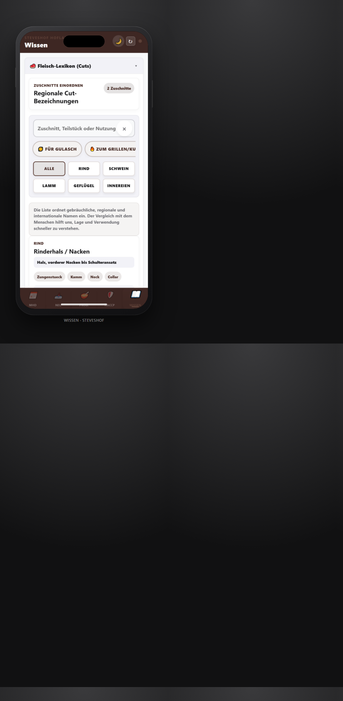
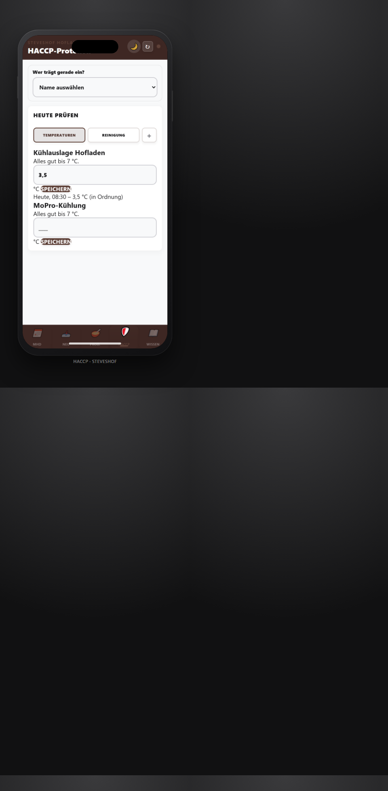

# CharcuLogic: Bedienungsanleitung StevesHof Hofladen

> **Mandant:** `StevesHof_Hauptbetrieb` · **Einsatz:** Laden-iPhone im Hofladen · **Stand:** Juli 2026

CharcuLogic ist für unseren Hofladen bewusst schlank konfiguriert. Wir arbeiten im Alltag nur mit:

- **MHD**: tägliche Haltbarkeitskontrolle inkl. **Retter-Box** vormerken (Standard: 21 Tage, umstellbar auf 7 oder 14 Tage)
- **Neu**: Wareneingang im Laden (Barcode-Scan, Lieferung abschließen)
- **Herkunft**: LMIV-Fleischherkunft erfassen (Etikettfoto + Charge)
- **Prod.**: Rezepte, Produktion und WRS-Kalkulation

Zusätzlich über das **Verwaltungs-Menü** (persönliche Admin-Konten): **HACCP**, **Wissen**, **Büro**. Den Link **Verwaltung** (/dev-dashboard) sehen nur **Betriebs-Admins**; andere Zugänge werden zur Haupt-App zurückgeleitet. Dort: Übersicht, Nutzer, Einstellungen, Protokoll, Thekenklade.

Die ausführliche Schritt-für-Schritt-Anleitung für den Liefertag steht unter [KOLLEGEN_ANLEITUNG_HOFLADEN_APP.md](../KOLLEGEN_ANLEITUNG_HOFLADEN_APP.md).

## 1. Zugang am Laden-iPhone (Gerät + Profil)

### Geräte-Zugang (einmalig auf dem Laden-iPhone)

```text
bestellung@steveshof-hofladen.de
```

Das Passwort bleibt intern. Es gehört nicht in Anleitungen oder Aushänge. Diese Anmeldung bleibt auf dem Gerät gespeichert. Statt einer PIN wählen wir danach unser **Profil** aus der Liste.

### Profil wählen (für MHD, Wareneingang und Herkunft)

Nach dem Geräte-Zugang wählen wir **unser Profil** aus der Liste — z. B. Bettina, Finn, Stephie, Nicole, Heiko, Paddy, Melanie, Efecan, Mimi oder **Andere** mit freiem Namen.

- Das aktive Profil steht **oben rechts** in der Kopfzeile.
- **MHD**, **Neu** und **Herkunft** verlangen ein gültiges Profil.
- Nach **zwei Stunden ohne Aktivität** erscheint die Profil-Auswahl beim nächsten MHD-, Wareneingang- oder Herkunft-Schritt erneut.
- Safari **nicht** im privaten Modus — sonst geht der Geräte-Zugang nach dem Schließen verloren.

## 2. Verhalten nach dem Start

Nach Geräte-Zugang und Profilwahl öffnet CharcuLogic automatisch den Tab **MHD**.

In der unteren Navigation sehen wir typischerweise:

| Tab | Zweck |
|-----|-------|
| **MHD** | Posten mit MHD im gewählten Zeitraum prüfen, Mengen korrigieren, Ware als OK, Raus, Küche oder Ausverkauft markieren |
| **Neu** | Ware scannen, Posten sammeln, **Gesamte Lieferung abschließen** |
| **Herkunft** | Etikett fotografieren, LOT und LMIV-Herkunft für die Theke speichern |
| **Prod.** | Rezepte, Produktion und WRS-Kalkulation |

Die Metzgerei-Erfassung bleibt für `StevesHof_Hauptbetrieb` deaktiviert. **HACCP**, **Wissen**, **Büro** und die digitale Thekenklade (**/dev-dashboard → Rückverfolgbarkeit**) sind für persönliche Admin-Konten sichtbar; am neutralen Laden-iPhone bleibt dieser Verwaltungsbereich ausgeblendet.

## 3. MHD-Monitor (vereinfacht)

Der MHD-Tab zeigt automatisch alle relevanten Posten im passenden Zeitraum: **MoPro 0-3 Tage**, **Trockenware 0-21 Tage**. Über **Zeitraum** können wir sonstige Artikel auf **0-3**, **0-7**, **0-14** oder **0-21 Tage** eingrenzen. Es gibt zwei Filter:

- **Zeitraum** — 7, 14 oder 21 Tage
- **Kategorie** — Alle Kategorien oder gezielt Frische, MoPro, Kühlware, TK, Getränke, Trockenware, Gewürze

Die früheren Filter **Bereich** und **Ansicht (ALARM/AKTION)** entfallen. Kritische Ware erscheint von selbst, sobald das MHD im gewählten Zeitraum liegt.

Wenn eine Kategorie in der MHD-Karte nicht stimmt, tippen wir **✏️ Bearbeiten**. Unter **Artikel-Stammdaten bearbeiten** stellen wir Bezeichnung, Marke, EAN und die Kategorie auf **MoPro & Kühlware** oder **Trockenware**. Nach dem Speichern wechselt unsere App in den passenden Filter.

Wenn ein MHD offensichtlich falsch erfasst wurde, tippen wir **MHD ändern** in der Karte. Unsere App korrigiert nur diesen MHD-Eintrag und fragt vor dem Speichern noch einmal nach.

Änderungen an Mengen und Status bündeln wir mit **Änderungen speichern**.

### Retter-Box vormerken

Bei Ware, die wir als **Retter-Box** anbieten wollen, tippen wir in der MHD-Karte **Box**. Kurz erscheint **Zur Retter-Box gelegt** — der Posten landet im heutigen Vorschlag.

**Drucken**, Rezeptidee und Status (**Verkauft** / **Verwerfen**) erledigen wir im **Büro-Bereich** mit Admin-Zugang unter **Retter-Boxen**. Am neutralen Laden-iPhone steht nur die **Box**-Aktion in der MHD-Karte zur Verfügung.


## 4. Wareneingang mit Serien-Scans und Lieferungsabschluss

Im Modus **Laden** sammeln wir Posten in einer Lieferung. Der Zähler **Posten in Lieferung** zeigt, wie viele Artikel bereits drin sind. Am Ende tippen wir **💾 Gesamte Lieferung abschließen** — dann erscheinen die Posten im MHD-Monitor.

Beim Einräumen ähnlicher Ware wählen wir die Kategorie nur einmal. Nach einem erfolgreichen Scan werden Barcode und Menge geleert, die **Kategorie (Laden)** bleibt erhalten.

Beispiel:

1. **Neu** öffnen (Modus **Laden**) — ggf. zuerst Profil wählen.
2. **MoPro** auswählen.
3. Artikel scannen, Produktname, **Hersteller / Zusatz**, Menge und MHD eintippen, **➕ Posten hinzufügen**.
4. Den nächsten MoPro-Artikel scannen und erneut **Posten hinzufügen**.
5. Wenn die Lieferung vollständig ist: **Gesamte Lieferung abschließen**.
6. Erst beim Wechsel zu Frische oder TK-Ware die Kategorie ändern.

Ohne eingetragenen Lieferanten speichert unsere App eine **Direkterfassung** mit unserem Profilnamen — das ist für schnelles Verräumen ohne Lieferschein vorgesehen.

Das MHD-Datum tippen wir direkt als `TT.MM.JJJJ`, zum Beispiel `31.12.2026`. Das Feld ist nach jedem neuen Posten wieder leer. Hersteller und Zusatzinfos erscheinen später auch in der MHD-Karten-Ansicht.


## 4b. Fleisch-Herkunft (LMIV / Thekenklade)

Im Tab **Herkunft** erfassen wir die gesetzliche Fleisch-Rückverfolgbarkeit:

1. **Herkunft** öffnen (ggf. zuerst Profil wählen).
2. **Etikett fotografieren**.
3. **Charge / LOT-Nummer** (Pflicht) und optional **Identitätskennzeichen**, **Öko-Kontrollstelle** und **Bio-Verband** eintragen.
4. **Tierart** wählen; bei einem Ursprungsland nur das Land, sonst die Mehrländer-Felder (bei Rind inkl. Zulassungsnummer Zerlegebetrieb).
5. **Herkunft speichern** — Status danach **aktiv in der Theke**.

Offline speichert unsere App den Eintrag lokal und synchronisiert ihn bei WLAN. Admins verwalten die Einträge unter **/dev-dashboard → Rückverfolgbarkeit** (Suche, Archivieren, Original-Etikett).

Details: [KOLLEGEN_ANLEITUNG_HOFLADEN_APP.md §2b](../KOLLEGEN_ANLEITUNG_HOFLADEN_APP.md) · [modulanleitungen/07-herkunft.md](../modulanleitungen/07-herkunft.md)

### Lieferschein per Foto (KI-Wareneingang) — noch nicht am Laden-iPhone

Am neutralen Laden-iPhone erfassen wir Ware **per Barcode-Scan** (siehe oben). Der KI-Wareneingang ist vorbereitet, am Hofladen-Terminal aber **noch ausgeblendet** (interner Testlauf). Der Button **📸 Lieferschein fotografieren / hochladen** erscheint dort deshalb noch nicht.

Nach Freigabe läuft der Ablauf so:

1. Im Tab **Neu** (Modus **Laden**) auf **📸 Lieferschein fotografieren / hochladen** tippen.
2. Lieferschein fotografieren oder ein Foto wählen.
3. Animation **„Die KI liest den Lieferschein für uns...“** abwarten.
4. In der Vorschau je Artikel **Name**, **Liefermenge** und **vorgeschlagenes MHD** prüfen.
5. **📥 Artikel in den Bestand einbuchen** tippen — Bestätigung: **„Lieferschein erfolgreich verbucht. Alle Bestände wurden erhöht!“**

Das **vorgeschlagene MHD** nutzt **Erfahrungswerte früherer Lieferungen** (Kennzeichen **Erfahrungswert**). Ohne Historie schlägt unsere App je Warengruppe vor — z. B. MoPro/Milch **14 Tage**, Wurst **10 Tage**, Trockenware **90 Tage**; sonst **7 Tage** (Kennzeichen **Standard-Haltbarkeit**). Vor dem Einbuchen können wir jedes MHD als `TT.MM.JJJJ` anpassen.

### Gespeicherte Kategorien prüfen und korrigieren

Unter **Neu → Letzte Eingänge** sehen wir die zuletzt erfassten Artikel mit ihrer Kategorie. Wir können die Kategorie per Dropdown ändern und mit **Kategorie speichern** übernehmen. Die App aktualisiert dabei sowohl die Laden-Kategorie als auch die interne MHD-Zuordnung.

**Letzte Eingänge** ist im Tab **Neu** für unser Team sichtbar — auch am Laden-iPhone ohne Admin-Anmeldung. **Stammdaten** und weitere Büro-Funktionen bleiben Admin vorbehalten und sind im Hofladen-Modus ausgeblendet.


## 5. Prod. öffnen

Der Tab **Prod.** enthält Rezepte, Produktion und WRS-Kalkulation.

Mit dem Kategorie-Button unter der Rezeptsuche grenzen wir die Rezeptliste im Filterblatt ein.


## 6. Wissen

**Wissen** öffnen wir über das **Verwaltungs-Menü**. Dort gibt es zwei aufklappbare Bereiche:

- **🥩 Fleisch-Lexikon (Cuts)**: Suche nach Zuschnitten, regionalen Namen, Lage und Verwendung.
- **📋 Hofladen-Handbücher**: kurze Anleitungen zu MHD-Ablauf-Regeln, Reinigung der Wurstküche und HACCP-Erklärung.

Alle Balken und Filter sind groß genug für die Bedienung am Laden-iPhone.



## 7. Kundenbestellungen und Sammel-Pickliste

Kundenbestellungen sind am Laden-iPhone im aktuellen StevesHof-Profil nicht aktiv. Für das tägliche Zusammenstellen bleibt im Bürobereich die **Sammel-Pickliste für heute** vorbereitet, falls Bestellungen später wieder freigeschaltet werden.

Unter **Produktions-Aufträge** sehen wir zwei kompakte Listen: **Heute zu kochen (Küche)** und **Heute zu zerlegen/packen (Metzgerei)**. Unsere App zeigt dort nur die zusammengefassten Mengen, die für Küche oder Metzgerei aus offenen Bestellungen entstehen. Bei Wiegeartikeln tragen wir den **Waagen-Wert** ein. Fertige Posten haken wir als **Fertig für den Laden** ab.

Unsere App fasst gleiche Artikel aus allen offenen, noch nicht eingepackten Bestellungen zusammen und sortiert sie nach Bereichen wie **Wurstküche**, **Molkereiprodukte** und **Hofladen-Spezialitäten**. Beim Zusammenstellen haken wir die Zeilen am Laden-iPhone ab und korrigieren bei Bedarf das **Tatsächliche Gewicht**. **Liste zurücksetzen** löscht nur diese Häkchen und ändert keine Bestellung.

Sobald alles im Laden-Kühlschrank steht, tippen wir auf **Alle enthaltenen Bestellungen als 'Abholbereit' markieren** und bestätigen, dass alle Artikel für heute eingepackt sind. Unsere App setzt die enthaltenen Bestellungen auf **Abholbereit**, speichert erfasste Waagen-Werte in den Bestellpositionen, schreibt automatisch eine kurze Info aufs Schwarze Brett und verschickt das **Kunden-Signal** als freundliche **Abhol-Nachricht** an die Kunden.

Für die Kiste im Kühlschrank drucken wir danach bei der Bestellung den **Lieferschein**. Der **Kisten-Zettel** zeigt Kundennamen, Abholdatum, bestellte Menge, tatsächliche Menge und den **Endpreis**. Bei abgewogenen Artikeln berechnet unsere App den **Abholpreis** aus dem Waagen-Wert.

Bei der Übergabe tippen wir **Als abgeholt markieren**. Unsere App zieht die tatsächliche Menge vom Lager ab; wenn kein Waagen-Wert erfasst wurde, nutzt sie die bestellte Menge. Danach sehen wir kurz **Bestand aktualisiert**.

## 8. Temperatur-Check (HACCP)

**HACCP** öffnen wir über das **Verwaltungs-Menü**. Dort dokumentieren wir Kühlungs-Temperaturen und Reinigungen. Der Tab **Team** ist für StevesHof deaktiviert — alle Tageskontrollen laufen hier.

1. **HACCP** öffnen.
2. Je Kühlstelle (z. B. **Kühlauslage Hofladen**, **MoPro-Kühlung**, **TK-Truhe**) den aktuellen Wert in das große Feld **„____ °C“** eintippen.
3. **Speichern** tippen — kurz erscheint **Wert gespeichert**.

Wird ein Wert zu hoch, färbt sich das Feld orange und wir lesen **„⚠️ Wert erhöht! Bitte Kühlung prüfen.“**. Der Wert wird trotzdem gespeichert; die Kühlung prüfen wir direkt danach. Unter jeder Karte steht der zuletzt eingetragene Wert mit Uhrzeit, damit wir den Tagesstand im Blick haben.

Die Werte landen sicher bei den HACCP-Protokollen unseres Betriebs. Die Druckansicht bleibt dem Admin-Bereich vorbehalten.



## 9. Offline-Betrieb

Kurze WLAN-Ausfälle sind unkritisch. Bereits geladene Bereiche bleiben nutzbar; unsere App zeigt beim Speichern **Lokal vorgemerkt** und synchronisiert die Einträge automatisch, sobald WLAN wieder verfügbar ist.

| Situation | Verhalten |
|-----------|-----------|
| Kein Internet beim Speichern | Eintrag wird lokal vorgemerkt. |
| Verbindung kommt zurück | Vorgemerkte Einträge werden automatisch übertragen. |
| Erstmalige Anmeldung am Laden-iPhone | Benötigt eine Internetverbindung. |

## 10. App aktualisieren

Nach einem Büro-Update laden wir die neue Version so:

1. Offene Eingaben speichern oder abbrechen.
2. Oben rechts **↻ App aktualisieren** tippen.
3. Nach dem Neuladen ggf. Geräte-Zugang und Profil erneut wählen.

Bei hartnäckigen Problemen (Schleife, weißer Bildschirm): einmal  
`https://hofsync-production.web.app/?reset=true` in Safari öffnen.

## 11. Datensicherung (Hintergrund)

Unsere Betriebsdaten (MHD, Lieferungen, HACCP, Herkunft/Thekenklade) liegen in **Firestore** (`hofsync-production`). **Point-in-Time Recovery (PITR)** ist in der Default-Datenbank aktiv — das Büro kann bei Bedarf auf frühere Stände zurückgreifen. Der Quellcode ist in GitHub gesichert; das Laden-iPhone speichert nur temporär (Offline-Queue, Entwürfe).

## 12. Administration

| Thema | Vorgehen |
|-------|----------|
| Passwort Hofladen-Zugang ändern | Firebase Console → Authentication → Nutzer → `bestellung@steveshof-hofladen.de` → **Passwort zurücksetzen** |
| Laden-iPhone neu anmelden | Geräte-Zugang `bestellung@…` + Profil wählen |
| Profil fehlt beim Wareneingang / Herkunft | Namen aus der Liste oder **Andere** wählen |
| App-Update | **↻** oben rechts; Notfall: `?reset=true` |
| Logout am festen Laden-iPhone | Im Alltagsbetrieb bewusst ausgeblendet, um versehentliches Abmelden zu vermeiden |
| Meister-/Admin-Zugang | Persönliches Konto mit `tenantId: StevesHof_Hauptbetrieb` und `role: admin` verwenden, z. B. `paddy@steveshof-hofladen.de` |
| Digitale Thekenklade | `/dev-dashboard` → Tab **Rückverfolgbarkeit** |
| Module freischalten | `/dev-dashboard` → Modul-Checkboxen (`enabledModules`, inkl. `traceability`) oder Abstimmung in `web/branding.js` |

---

*CharcuLogic · StevesHof Hofladen · `StevesHof_Hauptbetrieb`*
