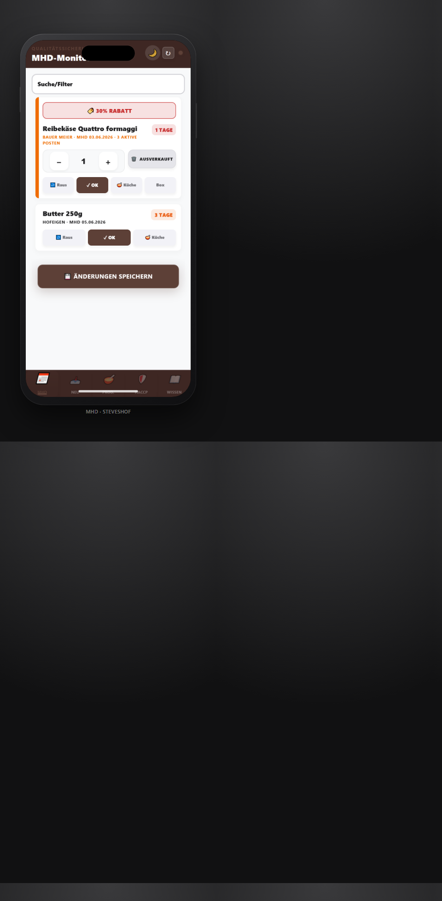
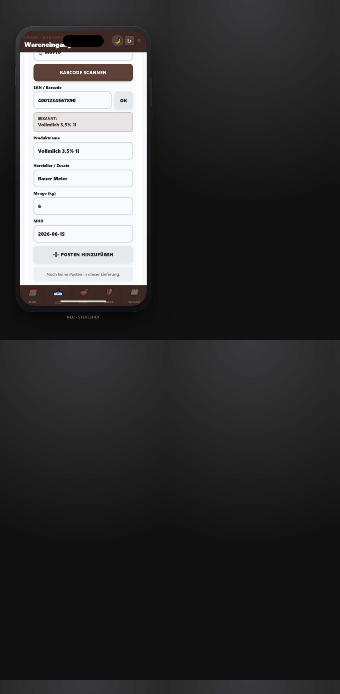
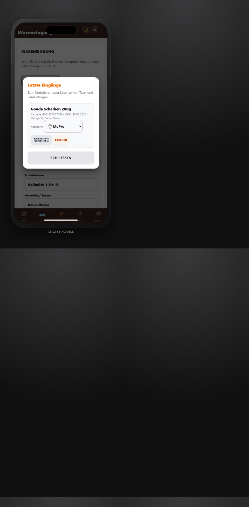
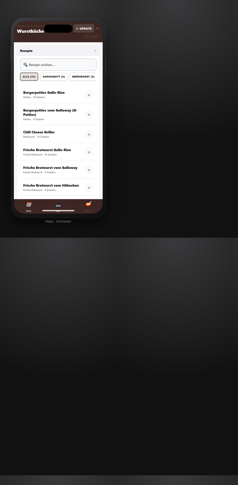

# CharcuLogic: Bedienungsanleitung StevesHof Hofladen

> **Mandant:** `StevesHof_Hauptbetrieb` · **Einsatz:** Laden-iPhone im Hofladen · **Stand:** Juni 2026

CharcuLogic ist für unseren Hofladen bewusst schlank konfiguriert. Wir arbeiten im Alltag nur mit:

- **MHD**: tägliche Haltbarkeitskontrolle (Standard: 21 Tage, umstellbar auf 7 oder 14 Tage)
- **Neu**: Wareneingang im Laden (Schnellerfassung)
- **Prod.**: Rezepte, Produktion und WRS-Kalkulation
- **HACCP**: Temperaturen und Reinigung dokumentieren
- **Wissen**: Fleisch-Lexikon und Hofladen-Handbücher

Die ausführliche Schritt-für-Schritt-Anleitung für den Liefertag steht unter [KOLLEGEN_ANLEITUNG_HOFLADEN_APP.md](../KOLLEGEN_ANLEITUNG_HOFLADEN_APP.md).

## 1. Gemeinsamer Zugang am Laden-iPhone

Unser **Laden-iPhone** wird einmal mit diesem neutralen Betriebszugang angemeldet:

```text
bestellung@steveshof-hofladen.de
```

Das Passwort bleibt intern. Es gehört nicht in Anleitungen oder Aushänge.

Für diesen Zugang überspringt unsere App die zusätzliche Mitarbeiter-PIN-Abfrage. Alle Vorgänge werden neutral als **StevesHof-Team** erfasst. Ein persönlicher Wechsel zwischen einzelnen Kolleginnen und Kollegen ist im Hofladen-Modus nicht nötig.

## 2. Verhalten nach dem Start

Nach erfolgreicher Anmeldung öffnet CharcuLogic automatisch den Tab **MHD**.

In der unteren Navigation sehen wir fünf Tabs:

| Tab | Zweck |
|-----|-------|
| **MHD** | Posten mit MHD im gewählten Zeitraum prüfen, Mengen korrigieren, Ware als OK, Raus, Küche oder Ausverkauft markieren |
| **Neu** | Neue Ware scannen; Menge, MHD und optional **Hersteller / Zusatz** erfassen |
| **Prod.** | Rezepte, Produktion und WRS-Kalkulation |
| **HACCP** | Temperaturen, Reinigung und Produktionswerte dokumentieren |
| **Wissen** | Fleisch-Lexikon und Hofladen-Handbücher lesen |

Der Tab **Wissen** ist die zentrale Wissensdatenbank für unser Team. Dort lesen wir das Fleisch-Lexikon und die kurzen Anleitungen zu MHD-Ablauf-Regeln, Reinigung der Wurstküche und HACCP-Erklärung. Die Metzgerei-Erfassung bleibt für `StevesHof_Hauptbetrieb` deaktiviert. Büro/Chargen sind für persönliche Admin-Konten sichtbar; am neutralen Laden-iPhone bleibt dieser Bereich ausgeblendet.

## 3. MHD-Monitor (vereinfacht)

Der MHD-Tab zeigt automatisch alle relevanten Posten im passenden Zeitraum: **MoPro 0-3 Tage**, **Trockenware 0-21 Tage**. Über **Zeitraum** können wir sonstige Artikel auf **0-3**, **0-7**, **0-14** oder **0-21 Tage** eingrenzen. Es gibt zwei Filter:

- **Zeitraum** — 7, 14 oder 21 Tage
- **Kategorie** — Alle Kategorien oder gezielt Frische, MoPro, Kühlware, TK, Getränke, Trockenware, Gewürze

Die früheren Filter **Bereich** und **Ansicht (ALARM/AKTION)** entfallen. Kritische Ware erscheint von selbst, sobald das MHD im gewählten Zeitraum liegt.

Wenn eine Kategorie in der MHD-Karte nicht stimmt, tippen wir das Kategorie-Badge oben an. Vor dem Speichern bestätigen wir die Änderung. Unsere App übernimmt die neue Kategorie für alle vorhandenen MHD-Einträge mit gleicher EAN und merkt sie für den nächsten Scan.

Wenn ein MHD offensichtlich falsch erfasst wurde, tippen wir **MHD ändern** in der Karte. Unsere App korrigiert nur diesen MHD-Eintrag und fragt vor dem Speichern noch einmal nach.

Änderungen an Mengen und Status bündeln wir mit **Änderungen speichern**.



## 4. Wareneingang mit Serien-Scans

Beim Einräumen ähnlicher Ware wählen wir die Kategorie nur einmal. Nach einem erfolgreichen Scan werden Barcode und Menge geleert, die **Kategorie (Laden)** bleibt erhalten.

Beispiel:

1. **Neu** öffnen (Modus **Laden**).
2. **MoPro** auswählen.
3. Artikel scannen, Produktname, **Hersteller / Zusatz**, Menge und MHD eintippen, **Posten hinzufügen**.
4. Den nächsten MoPro-Artikel scannen.
5. Erst beim Wechsel zu Frische oder TK-Ware die Kategorie ändern.

Das MHD-Datum tippen wir direkt als `TT.MM.JJJJ`, zum Beispiel `31.12.2026`. Das Feld ist nach jedem neuen Posten wieder leer, damit wir nichts löschen müssen. Hersteller und Zusatzinfos erscheinen später auch in der MHD-Karten-Ansicht.



### Lieferschein per Foto einlesen (KI-Wareneingang)

Statt jeden Posten einzeln zu scannen, lassen wir den Lieferschein von der KI lesen:

1. Im Tab **Neu** (Modus **Laden**) auf **📸 Lieferschein fotografieren / hochladen** tippen.
2. Lieferschein mit dem Laden-iPhone fotografieren oder ein vorhandenes Foto wählen.
3. Es läuft kurz die Animation **„Die KI liest den Lieferschein für uns...“**.
4. In der Vorschau prüfen wir je Artikel **Name**, **Liefermenge** und das **vorgeschlagene MHD**.
5. **📥 Artikel in den Bestand einbuchen** tippen — die Bestätigung lautet **„Lieferschein erfolgreich verbucht. Alle Bestände wurden erhöht!“**

Das **vorgeschlagene MHD** stammt aus den **Erfahrungswerten der letzten Lieferungen**: Unsere App merkt sich, wie lange derselbe Artikel zuletzt haltbar war, und rechnet die Spanne ab heute neu aus. Ohne Erfahrungswert nutzt sie einen soliden Standardwert je Warengruppe (Gemüse 3 Tage, Molkerei 10 Tage). Vor dem Einbuchen können wir jedes MHD noch als `TT.MM.JJJJ` anpassen. Beim Einbuchen erhöht unsere App den Bestand der gelieferten Artikel automatisch.

### Gespeicherte Kategorien prüfen und korrigieren

Unter **Neu → Letzte Eingänge** sehen wir die zuletzt erfassten Artikel mit ihrer Kategorie. Wir können die Kategorie per Dropdown ändern und mit **Kategorie speichern** übernehmen. Die App aktualisiert dabei sowohl die Laden-Kategorie als auch die interne MHD-Zuordnung.

**Letzte Eingänge** ist im Tab **Neu** für unser Team sichtbar — auch am Laden-iPhone ohne Admin-Anmeldung. **Stammdaten** und weitere Büro-Funktionen bleiben Admin vorbehalten und sind im Hofladen-Modus ausgeblendet.



## 5. Prod. öffnen

Der Tab **Prod.** enthält Rezepte, Produktion und WRS-Kalkulation.

Mit dem Kategorie-Button unter der Rezeptsuche grenzen wir die Rezeptliste im Filterblatt ein.



## 6. Wissen

Im Tab **Wissen** gibt es zwei aufklappbare Bereiche:

- **🥩 Fleisch-Lexikon (Cuts)**: Suche nach Zuschnitten, regionalen Namen, Lage und Verwendung.
- **📋 Hofladen-Handbücher**: kurze Anleitungen zu MHD-Ablauf-Regeln, Reinigung der Wurstküche und HACCP-Erklärung.

Alle Balken und Filter sind groß genug für die Bedienung am Laden-iPhone.

## 7. Kundenbestellungen und Sammel-Pickliste

Kundenbestellungen sind am Laden-iPhone im aktuellen StevesHof-Profil nicht aktiv. Für das tägliche Zusammenstellen bleibt im Bürobereich die **Sammel-Pickliste für heute** vorbereitet, falls Bestellungen später wieder freigeschaltet werden.

Unter **Produktions-Aufträge** sehen wir zwei kompakte Listen: **Heute zu kochen (Küche)** und **Heute zu zerlegen/packen (Metzgerei)**. Unsere App zeigt dort nur die zusammengefassten Mengen, die für Küche oder Metzgerei aus offenen Bestellungen entstehen. Bei Wiegeartikeln tragen wir den **Waagen-Wert** ein. Fertige Posten haken wir als **Fertig für den Laden** ab.

Unsere App fasst gleiche Artikel aus allen offenen, noch nicht eingepackten Bestellungen zusammen und sortiert sie nach Bereichen wie **Wurstküche**, **Molkereiprodukte** und **Hofladen-Spezialitäten**. Beim Zusammenstellen haken wir die Zeilen am Laden-iPhone ab und korrigieren bei Bedarf das **Tatsächliche Gewicht**. **Liste zurücksetzen** löscht nur diese Häkchen und ändert keine Bestellung.

Sobald alles im Laden-Kühlschrank steht, tippen wir auf **Alle enthaltenen Bestellungen als 'Abholbereit' markieren** und bestätigen, dass alle Artikel für heute eingepackt sind. Unsere App setzt die enthaltenen Bestellungen auf **Abholbereit**, speichert erfasste Waagen-Werte in den Bestellpositionen, schreibt automatisch eine kurze Info aufs Schwarze Brett und verschickt das **Kunden-Signal** als freundliche **Abhol-Nachricht** an die Kunden.

Für die Kiste im Kühlschrank drucken wir danach bei der Bestellung den **Lieferschein**. Der **Kisten-Zettel** zeigt Kundennamen, Abholdatum, bestellte Menge, tatsächliche Menge und den **Endpreis**. Bei abgewogenen Artikeln berechnet unsere App den **Abholpreis** aus dem Waagen-Wert.

Bei der Übergabe tippen wir **Als abgeholt markieren**. Unsere App zieht die tatsächliche Menge vom Lager ab; wenn kein Waagen-Wert erfasst wurde, nutzt sie die bestellte Menge. Danach sehen wir kurz **Bestand aktualisiert**.

## 8. Temperatur-Check

Im Tab **HACCP** dokumentieren wir die Kühlungs-Temperaturen und Reinigungen.

1. **HACCP** öffnen.
2. Je Kühlstelle (z. B. **Kühlauslage Hofladen**, **MoPro-Kühlung**, **TK-Truhe**) den aktuellen Wert in das große Feld **„____ °C“** eintippen.
3. **Speichern** tippen — kurz erscheint **Wert gespeichert**.

Wird ein Wert zu hoch, färbt sich das Feld orange und wir lesen **„⚠️ Wert erhöht! Bitte Kühlung prüfen.“**. Der Wert wird trotzdem gespeichert; die Kühlung prüfen wir direkt danach. Unter jeder Karte steht der zuletzt eingetragene Wert mit Uhrzeit, damit wir den Tagesstand im Blick haben.

Die Werte landen sicher bei den HACCP-Protokollen unseres Betriebs. Die Druckansicht bleibt dem Admin-Bereich vorbehalten.

## 9. Offline-Betrieb

Kurze WLAN-Ausfälle sind unkritisch. Bereits geladene Bereiche bleiben nutzbar; unsere App zeigt beim Speichern **Lokal vorgemerkt** und synchronisiert die Einträge automatisch, sobald WLAN wieder verfügbar ist.

| Situation | Verhalten |
|-----------|-----------|
| Kein Internet beim Speichern | Eintrag wird lokal vorgemerkt. |
| Verbindung kommt zurück | Vorgemerkte Einträge werden automatisch übertragen. |
| Erstmalige Anmeldung am Laden-iPhone | Benötigt eine Internetverbindung. |

## 10. Administration

| Thema | Vorgehen |
|-------|----------|
| Passwort Hofladen-Zugang ändern | Firebase Console → Authentication → Nutzer → `bestellung@steveshof-hofladen.de` → **Passwort zurücksetzen** |
| Laden-iPhone neu anmelden | Neutralen Betriebszugang verwenden und angemeldet lassen |
| Logout am festen Laden-iPhone | Im Alltagsbetrieb bewusst ausgeblendet, um versehentliches Abmelden zu vermeiden |
| Meister-/Admin-Zugang | Persönliches Konto mit `tenantId: StevesHof_Hauptbetrieb` und `role: admin` verwenden, z. B. `paddy@steveshof-hofladen.de` |
| Weitere Module aktivieren | Erst nach Abstimmung in `web/branding.js` für `steveshof_hauptbetrieb` freischalten |

---

*CharcuLogic · StevesHof Hofladen · `StevesHof_Hauptbetrieb`*
